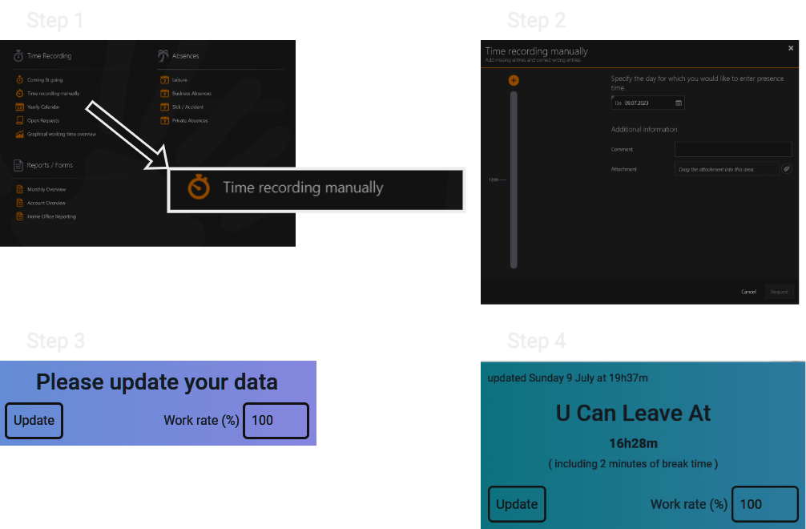

# UCanLeaveAt

It's an ATOSS Chrome extension that shows when you can leave!

Features :

- Store the data in the extension.
- Adjust with your work rate

# How it work

- Step 1 : In ATOSS, click on "Time recording manually"
- Step 2 : After the "Time recording manually" window opened, click on the extension.
- Step 3 : The extension window should popup, click on "Update" button
- Step 4 : The windows should now display info about the working time. You can now easly at anytime and anywhere click on the extension icon to display the data previously stored.

