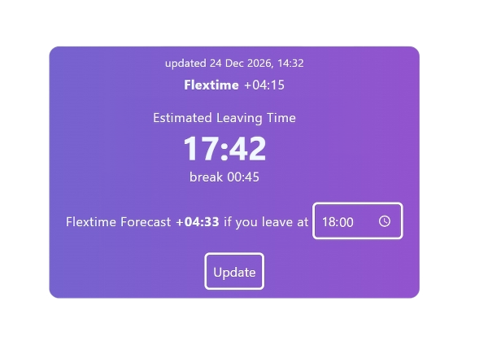

# U Can Leave At

A Chrome extension that reads your ATOSS time-recording data and tells you when you can leave.

Open ATOSS in your browser, click the extension icon, then click Update. The extension opens the time-recording panel on your current ATOSS tab and reads your records.

## Screenshots

## Features

- **Auto-clicks for you** — opens the time-recording panel and reads your records without you touching ATOSS
- **Cached results** — reopen the popup any time to see your last fetched data
- **Work-rate aware** — adjust the percentage (50–100%) to recompute for part-time schedules
- **Flextime forecast** — enter a leaving time to see the projected flextime balance

## Usage

1. Open ATOSS in a browser tab and sign in.
2. Click the extension icon to open the popup.
   - If you're not on an ATOSS tab, the popup shows a message asking you to open one.
   - If you have cached data, it's shown immediately.
3. Click **Update** to open the time-recording panel and read your latest records.
4. The popup displays flextime, "U can leave at", break minutes, and forecast.

Optional controls:

- **Work rate (%)** — recomputes leave-time from cached records without re-fetching
- **Flextime Forecast — if u leave at HH:MM** — projects what your flextime balance will be

## Credit

Original concept and some scraping logic adapted from [philippecade/howlong](https://github.com/philippecade/howlong).
